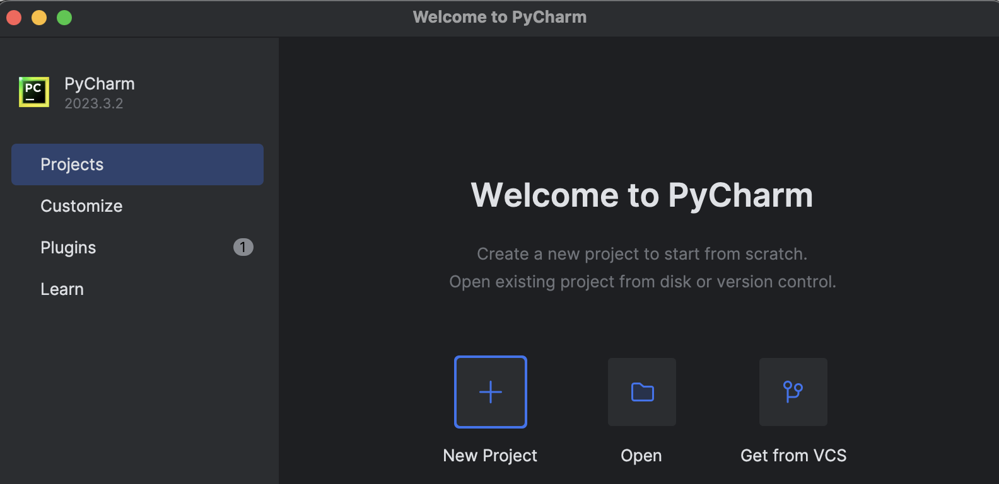
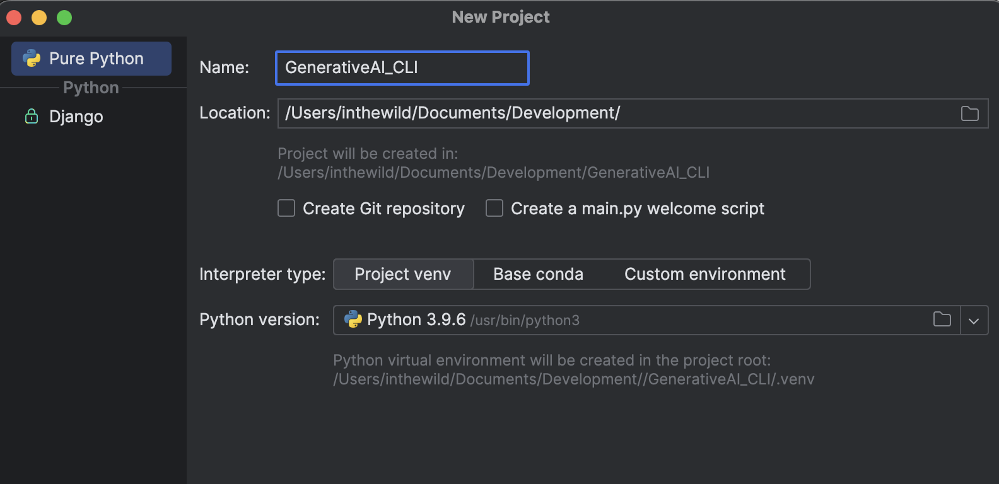
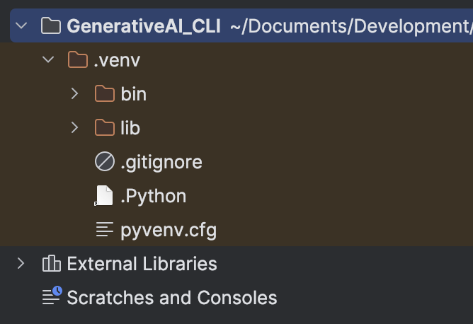
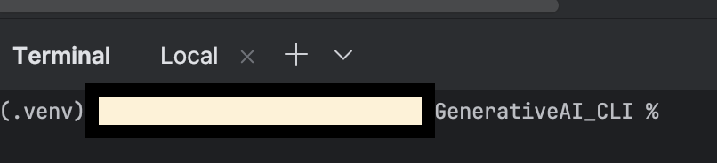
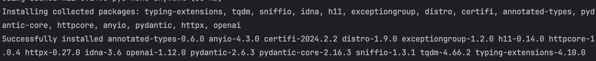
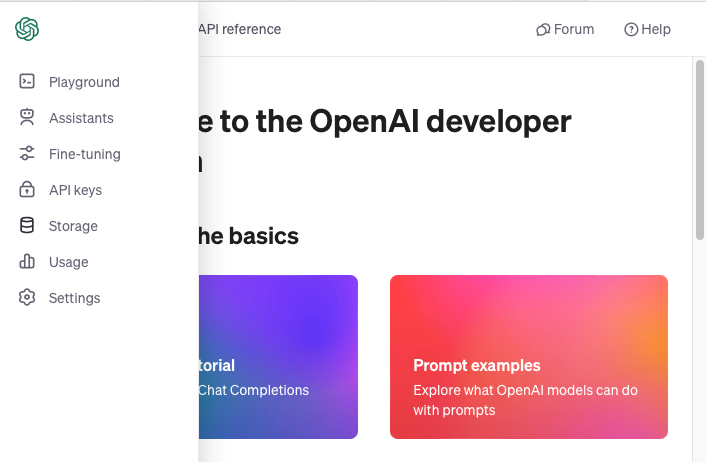
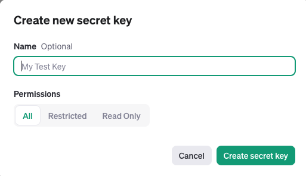
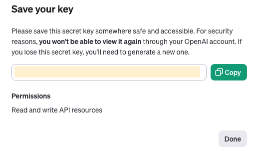
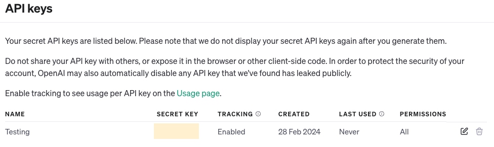

# Generative AI: An introduction using the OpenAI API

- [Generative AI: An introduction using the OpenAI API](#generative-ai-an-introduction-using-the-openai-api)
  - [What is Generative AI?](#what-is-generative-ai)
  - [OpenAI, the AI pioneers](#openai-the-ai-pioneers)
  - [OpenAI API](#openai-api)
  - [What will we build?](#what-will-we-build)
    - [Prerequisites:](#prerequisites)
  - [Project Setup](#project-setup)
  - [Setup our API key](#setup-our-api-key)
  - [The Generative AI CLI Application](#the-generative-ai-cli-application)
  - [Testing our CLI application](#testing-our-cli-application)
  - [Taking a closer look at our code](#taking-a-closer-look-at-our-code)

## What is Generative AI?

Artificial intelligence, often abbreviated as AI, is a rapidly evolving technology that is poised to revolutionize various aspects of human work and operations in the future. It refers to the simulation of human intelligence processes by machines, especially computer systems. These processes include learning, reasoning and self-correction.

In this artice, we will focus on using AI to generate certain things for us. This is called Generative AI. It refers to a subset of artificial intelligence techniques focused on creating or generating new data that is similar to existing data. Generative AI models are designed to process certain tasks, such as classification or prediction. Subsequently, they generate novel outputs based on the processed information

## OpenAI, the AI pioneers

OpenAI is an independent organization focused on advancing artificial intelligence for the better of mankind. Founded in December 2015 by several entrepreneurs and researchers such as Elon Musk, Sam Altman, Greg Brockman,  Ilya Sutskever, Wojciech Zaremba, and John Schulman, among others.

The organization's mission is to ensure that artificial general intelligence (AGI) - AI that can outperform humans across a wide range of tasks - benefits all of humanity.

OpenAI is known for its contributions to various areas of AI research, including reinforcement learning, natural language processing, computer vision, and robotics. Some of its notable achievements include developing state-of-the-art language models like GPT (Generative Pre-trained Transformer) and GPT-3.

## OpenAI API

We will be using the OpenAI API (Application programming interface - used by software developers to integrate various software systems.) which will give us a range of state-of-the-art AI models through a simple programming interface.

Some of the pre-trained model we'll use includes:

* GPT (Generative Pre-trained Transformer): A family of transformer-based language models trained on large corpora of text data.
* CLIP (Contrastive Language-Image Pre-training): A model trained on a large dataset of text and images to learn a unified representation space for both modalities. 
* DALL-E: As previously mentioned, DALL-E is a model trained to generate images from textual descriptions.


## What will we build?
Since this article is meant for beginner to intermediate software developers, we'll keep the application simple and informative.

The focus will be on building a CLI (Command Line Interface) app that is capable of the following:

* Text generation: Where users can input prompts or topics, and the application generates creative and coherent text responses using the GPT model.
* Image captioning: Which will take user-uploaded images and generates descriptive captions for them using the CLIP model.
* Artistic Image Generation: Allowing users to generate artistic images or visual compositions based on textual prompts using the DALL-E model

We will be using Python as the base programming language.

### Prerequisites:
* Knowledge of Python and building Python applications
* Python (3.7.1 or newer) installed on your computer
* An IDE, we'll be using PyCharm.


## Project Setup

1. Let's go ahead and create a new project in PyCharm, by choosing the New Project option after the PyCharm IDE loads.


2. Now we can select where the project should be saved and also name our project.


3. Our starting project structure should now look as follows:


4. When opening the terminal within the PyCharm IDE, we notice that PyCharm activates the virtual environment specific to our project:


5. Now we need to create the following files so that we have a better starting project structure. Let's create these in the project root:

	* README.md - Which will be used save important information regarding our 	project.
	* GenerativeAI_CLI.py - This will be our main entry point in the program.
	* requirements.txt - Which will contain our project dependancies, which 	  is used by the pip package manager.
6. We need to install the OpenAPI Python library in order to use the features we need. To do so, open the terminal in PyCharm and run the following command:

```bash
pip install --upgrade openai
```
If the install was successful, we see the following result:


## Setup our API key

In order to use the OpenAI API, we will need an API key that will be used to authorise our communication with the API.

Let's go ahead and create an API key.

1. In the browser, enter the following URL: https://platform.openai.com/

2. Once the site has loaded, go ahead and Sign up using your preferred sign up option.

3. After successfully signing up, and logging into the OpenAPI platform, we should see the following menu on the top left corner. Let's select the API Keys option to generate our API key.



4.	If you've just registered, you'll need to verify your phone number. Please go ahead and verify as needed.


5. We can now go ahead and generate the secret key. Please choose the 'Create new secret key' button. The following window with options should then be displayed:



6. Enter a key name, and then select 'Create secret key'. After the key has been generated, you will have a chance to copy the key and store it somewhere save.



7. We also need to set the 'OPENAI_API_KEY' environment variable on our system. Please go ahead and run the following command:

	For MacOS:

	```bash
	export OPENAI_API_KEY='your-api-key-here'
	```

	For Windows:
	```bash
	export OPENAI_API_KEY='your-api-key-here'
	```

8. Our API key is now setup, we can now go ahead and start building our CLI application that will harness the features of the OpenAI API.




## The Generative AI CLI Application

We are going to use the following code to help us understand Generative AI better and to provide a base for any further experimental work.

Let's open our GenerativeAI_CLI.py file, and paste the following code.

```python
from openai import OpenAI

client = OpenAI()


def process_ai_generation(question):
    response = client.chat.completions.create(
        model="gpt-3.5-turbo",
        messages=[
            {"role": "system", "content": question},
        ]
    )

    print("<< " + response.choices[0].message.content)


def process_ai_vision(question, img_url):
    response = client.chat.completions.create(
        model="gpt-4-vision-preview",
        messages=[
            {
                "role": "user",
                "content": [
                    {"type": "text", "text": question},
                    {
                        "type": "image_url",
                        "image_url": {
                            "url": img_url,
                        },
                    },
                ],
            }
        ],
        max_tokens=4096,
    )
    print("<< IMAGE CAPTION")
    print(response.choices[0].message.content)


def process_text_generation():
    print("\n-- Generative AI with Text generation! --")
    print("Please feel free to ask any question")
    print("To go to main menu, simply type END")

    question = ""
    while question != "END":
        question = input()
        if question != "END":
            process_ai_generation(question)

    if question == "END":
        main_menu_processing()


def process_vision_generation():
    print("\n-- Generative AI with Image captioning! --")
    print("Please feel free to ask any question regarding an image")
    print("To go to main menu, simply type END")

    img_url = ""
    question = ""
    while img_url != "END" and question != "END":
        print("Please enter the URL of the image you have a question about")
        img_url = input()

        if img_url != "END":
            print("What is the question about this image?")
            question = input()
            if question != "END":
                process_ai_vision(question, img_url)

        if question == "END" or img_url == "END":
            main_menu_processing()


def print_main_menu():
    print("\n----- MAIN MENU -----")
    print("Please choose an option to continue")
    print("Options")
    print("1 - Text generation")
    print("2 - Image captioning")
    print("3 - Exit")


def main_menu_processing():
    print_main_menu()
    option_chosen = input()

    if option_chosen == "1":
        process_text_generation()
    elif option_chosen == "2":
        process_vision_generation()


if __name__ == '__main__':
    print("Welcome to the Generative AI CLI!")
    main_menu_processing()


```

## Testing our CLI application
Now that we have our CLI application ready, let's run it to see what functionality it provides.

In the terminal, run the following command:


```bash
python3 GenerativeAI_CLI.py
```

Our CLI application is then started, and the initial menu is displayed:

```bash
Welcome to the Generative AI CLI!

----- MAIN MENU -----
Please choose an option to continue
Options
1 - Text generation
2 - Image captioning
3 - Exit
```

Let's choose option '1', which will give us the GPT model capability. Enter '1' and press 'enter'. We see the next prompt available to us:

```bash
-- Generative AI with Text generation! --
Please feel free to ask any question
To go to main menu, simply type END
```

Now let's give the GPT model a difficult question to answer and see what kind of response we get.
Enter the following question, and press 'enter'

```bash
In which year was Python created, and who was the original creator? Can you also tell us why Python is such a popular language today?  
```

We get a rather accurate response:

```bash
<< Python was created in 1989 by Dutch programmer Guido van Rossum. Python is popular today for several reasons:

1. **Simplicity:** Python is known for its simplicity and readability, making it easier to learn and understand for beginners.

2. **Versatility:** Python is a very versatile language that can be used for various purposes like web development, data analysis, artificial intelligence, machine learning, automation, etc.

3. **Community Support:** Python has a large and active community of developers who contribute to its growth by creating libraries, frameworks, and tools that make development easier and faster.

4. **Libraries and Frameworks:** Python has a rich ecosystem of libraries and frameworks like Django, Flask, NumPy, Pandas, TensorFlow, etc., which make it easier to develop complex applications efficiently.

5. **Job Opportunities:** The demand for Python developers is continuously increasing due to its popularity in various fields like data science, machine learning, and web development, making it a lucrative skill to have.

```

When in the GPT model (option 1), the user can re-ask any questions until 'END' is entered.
Let's see how option '2' works. Type 'END' followed by 'enter'. We see the main menu again.

```bash
----- MAIN MENU -----
Please choose an option to continue
Options
1 - Text generation
2 - Image captioning
3 - Exit
```

Choose option 2 by entering '2' and followed by enter. We are now prompted for the image captioning service.

```bash
-- Generative AI with Image captioning! --
Please supply any public URL of an image, and then ask anything regarding this image
To go to main menu, simply type END
Please enter the URL of the image:
```

As an example, let's supply the following URL of an image showing the Big Wall of China.

URL: https://upload.wikimedia.org/wikipedia/commons/thumb/2/23/The_Great_Wall_of_China_at_Jinshanling-edit.jpg/1920px-The_Great_Wall_of_China_at_Jinshanling-edit.jpg

Image:


In the CLI prompt, enter the URL and hit enter. We are now required to enter a question regarding this image.

```bash
-- Generative AI with Image captioning! --
Please supply any public URL of an image, and then ask anything regarding this image
To go to main menu, simply type END
Please enter the URL of the image:
https://upload.wikimedia.org/wikipedia/commons/thumb/2/23/The_Great_Wall_of_China_at_Jinshanling-edit.jpg/1920px-The_Great_Wall_of_China_at_Jinshanling-edit.jpg
What is the question about this image?
```

We can ask the following:

```bash
What architecture is displayed in the image, when was it built and what is the significance of it? 
```

We get a quite detailed response:

```bash
The image shows a section of the Great Wall of China, one of the most iconic architectural marvels in the world. 

The Great Wall was built over several centuries, with the earliest parts dating back to as early as the 7th century BC. The most well-known sections were built during the Ming Dynasty (1368-1644 AD).

The Great Wall has significant historical, cultural, and architectural importance as it represents an astonishing human effort to build a fortification for the protection of Chinese states against various nomadic groups from the Eurasian Steppe. 

Stretching approximately 21,196 kilometers (13,171 miles), it is often celebrated as one of the most impressive historical monuments in the world and is considered a symbol of China's historical strength and perseverance.

The Great Wall is also a UNESCO World Heritage Site and has become a powerful symbol of China's national identity and heritage, attracting millions of tourists from around the globe every year.

```

Now that we have sampled both GPT and image capturing functionalities, we can exit to main menu, by typing 'END' followed by 'enter'. And then to exit CLI, we can type '3' followed by 'enter'.


## Taking a closer look at our code

If we look closer at the code, we really want to specifically look at these two methods:
```python
def process_ai_generation(question):
```
```python
def process_ai_vision(question, img_url):
```

These methods are used to call the OpenAI API by specifying the parameters, and then handling the response.

The rest of the CLI is pure Python logic that handles the input, output and logical flow.

1. Let's look at the first method.

```python
def process_ai_generation(question):
    response = client.chat.completions.create(
        model="gpt-3.5-turbo",
        messages=[
            {"role": "system", "content": question},
        ]
    )

    print("<< " + response.choices[0].message.content)
```

The above method is used to query the OpenAI API with a specific question using the gpt-3.5-turbo AI model. We supply a 'role' and 'content' as input. Please note that the client object has been imported earlier in the code.

We then print the response from the AI model, by retrieving if from response.choices[0].message.content). This is then displayed to the user.

To read the specification on this model, and for more advanced processing, please visit the below link:

https://platform.openai.com/docs/guides/text-generation/chat-completions-api


2. Now let's look at the image captioning method.

```python
def process_ai_vision(question, img_url):
    response = client.chat.completions.create(
        model="gpt-4-vision-preview",
        messages=[
            {
                "role": "user",
                "content": [
                    {"type": "text", "text": question},
                    {
                        "type": "image_url",
                        "image_url": {
                            "url": img_url,
                        },
                    },
                ],
            }
        ],
        max_tokens=4096,
    )
    print("<< IMAGE CAPTION")
    print(response.choices[0].message.content)
```

This API call is a bit more advanced. Firstly we need to use a different model (gpt-4-vision-preview). We still specify the 'role' and 'content', but the content needs more field definition as earlier. 

As with earlier example, we then print the response from the AI model, by retrieving if from response.choices[0].message.content). This is then displayed to the user.

For more on this API call, please see the below URL.

https://platform.openai.com/docs/guides/vision