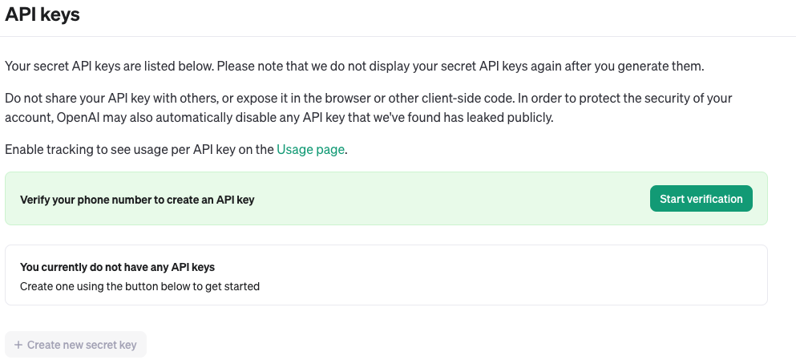

# Generative AI: An introduction using the OpenAI API

- [Generative AI: An introduction using the OpenAI API](#generative-ai-an-introduction-using-the-openai-api)
	- [What is Generative AI?](#what-is-generative-ai)
	- [OpenAI, the AI pioneers](#openai-the-ai-pioneers)
	- [OpenAI API](#openai-api)
	- [What will we build?](#what-will-we-build)
	- [Project Setup](#project-setup)
	- [Setup our API key](#setup-our-api-key)
	- [The Generative AI CLI Application](#the-generative-ai-cli-application)

## What is Generative AI?

Artificial intelligence, often abbreviated as AI, is a rapidly evolving technology that is poised to revolutionize various aspects of human work and operations in the future. It refers to the simulation of human intelligence processes by machines, especially computer systems. These processes include learning, reasoning and self-correction.

In this artice, we will focus on using AI to generate certain things for us. This is called Generative AI. It refers to a subset of artificial intelligence techniques focused on creating or generating new data that is similar to existing data. Generative AI models are designed to process certain tasks, such as classification or prediction. Subsequently, they generate novel outputs based on the processed information

## OpenAI, the AI pioneers

OpenAI is an independent organization focused on advancing artificial intelligence for the better of mankind. Founded in December 2015 by several entrepreneurs and researchers such as Elon Musk, Sam Altman, Greg Brockman,  Ilya Sutskever, Wojciech Zaremba, and John Schulman, among others.

The organization's mission is to ensure that artificial general intelligence (AGI) - AI that can outperform humans across a wide range of tasks - benefits all of humanity.

OpenAI is known for its contributions to various areas of AI research, including reinforcement learning, natural language processing, computer vision, and robotics. Some of its notable achievements include developing state-of-the-art language models like GPT (Generative Pre-trained Transformer) and GPT-3.

## OpenAI API

We will be using the OpenAI API (Application programming interface - used by software developers to integrate various software systems.) which will give us a range of state-of-the-art AI models through a simple programming interface.

Some of the pre-trained model we'll use includes:

* GPT (Generative Pre-trained Transformer): A family of transformer-based language models trained on large corpora of text data.
* CLIP (Contrastive Language-Image Pre-training): A model trained on a large dataset of text and images to learn a unified representation space for both modalities. 
* DALL-E: As previously mentioned, DALL-E is a model trained to generate images from textual descriptions.


## What will we build?
Since this article is meant for beginner to intermediate software developers, we'll keep the application simple and informative.

The focus will be on building a CLI (Command Line Interface) app that is capable of the following:

* Text generation: Where users can input prompts or topics, and the application generates creative and coherent text responses using the GPT model.
* Image captioning: Which will take user-uploaded images and generates descriptive captions for them using the CLIP model.
* Artistic Image Generation: Allowing users to generate artistic images or visual compositions based on textual prompts using the DALL-E model

We will be using Python as the base programming language.

###Prerequisites:
* Knowledge of Python and building Python applications
* Python (3.7.1 or newer) installed on your computer
* An IDE, we'll be using PyCharm.


## Project Setup

1. Let's go ahead and create a new project in PyCharm, by choosing the New Project option after the PyCharm IDE loads.


2. Now we can select where the project should be saved and also name our project.


3. Our starting project structure should now look as follows:


4. When opening the terminal within the PyCharm IDE, we notice that PyCharm activates the virtual environment sepcific to our project:


5. Now we need to create the following files so that we have a better starting project structure. Let's create these in the project root:

	* README.md - Which will be used save important information regarding our 	project.
	* GenerativeAI_CLI.py - This will be our main entry point in the program.
	* requirements.txt - Which will contain our project dependancies, which 	  is used by the pip package manager.
6. We need to install the OpenAPI Python library in order to use the features we need. To do so, open the terminal in PyCharm and run the following command:

```bash
pip install --upgrade openai
```
If the install was successful, we see the following result:


## Setup our API key

In order to use the OpenAI API, we will need an API key that will be used to authorise our communication with the API.

Let's go ahead and create an API key.

1. In the browser, enter the following URL: https://platform.openai.com/

2. Once the site has loaded, go ahead and Sign up using your preferred sign up option.

3. After successfully signing up, and logging into the OpenAPI platform, we should see the following menu on the top left corner. Let's select the API Keys option to generate our API key.


4.	If you've just registered, you'll need to verify your phone number. Please go ahead and verify as needed.



5. We can now go ahead and generate the secret key. Please choose the 'Create new secret key' button, the following window with options should then be displayed:


6. Enter a key name, and then select 'Create secret key'. You'll then be prompted to copy the key and store it somewhere save.


7. We also need to set the 'OPENAI_API_KEY' environment variable on our system. Please go ahead and run the following command:

	MacOS:

	```bash
	export OPENAI_API_KEY='your-api-key-here'
	```

	Windows:
	```bash
	export OPENAI_API_KEY='your-api-key-here'
	```

8. Our API key is now setup, we can now go ahead and start building our CLI application that will harness the features of the OpenAI API.


## The Generative AI CLI Application

We are going to use the following code to help us understand Generative AI better and to provide a base for any further experimental work.

Let's open our GenerativeAI_CLI.py file, and paste the following code.

```python
from openai import OpenAI

client = OpenAI()


def process_ai_generation(question):
    response = client.chat.completions.create(
        model="gpt-3.5-turbo",
        messages=[
            {"role": "system", "content": question},
        ]
    )

    print("<< " + response.choices[0].message.content)


def process_ai_vision(question, img_url):
    response = client.chat.completions.create(
        model="gpt-4-vision-preview",
        messages=[
            {
                "role": "user",
                "content": [
                    {"type": "text", "text": question},
                    {
                        "type": "image_url",
                        "image_url": {
                            "url": img_url,
                        },
                    },
                ],
            }
        ],
        max_tokens=4096,
    )
    print("<< IMAGE CAPTION")
    print(response.choices[0].message.content)


def process_text_generation():
    print("\n-- Generative AI with Text generation! --")
    print("Please feel free to ask any question")
    print("To go to main menu, simply type END")

    question = ""
    while question != "END":
        question = input()
        if question != "END":
            process_ai_generation(question)

    if question == "END":
        main_menu_processing()


def process_vision_generation():
    print("\n-- Generative AI with Image captioning! --")
    print("Please feel free to ask any question regarding an image")
    print("To go to main menu, simply type END")

    img_url = ""
    question = ""
    while img_url != "END" and question != "END":
        print("Please enter the URL of the image you have a question about")
        img_url = input()

        if img_url != "END":
            print("What is the question about this image?")
            question = input()
            if question != "END":
                process_ai_vision(question, img_url)

        if question == "END" or img_url == "END":
            main_menu_processing()


def print_main_menu():
    print("\n----- MAIN MENU -----")
    print("Please choose an option to continue")
    print("Options")
    print("1 - Text generation")
    print("2 - Image captioning")
    print("3 - Exit")


def main_menu_processing():
    print_main_menu()
    option_chosen = input()

    if option_chosen == "1":
        process_text_generation()
    elif option_chosen == "2":
        process_vision_generation()


if __name__ == '__main__':
    print("Welcome to the Generative AI CLI!")
    main_menu_processing()


```


